# Gaze-Estimation
### a) Papers

### 1. Gaze Estimation for Assisted Living Environments(WACV-2020)
    
   - Paper Repository: https://bitbucket.org/phil_dias/gaze-estimation/src/master/
   - Paper Link: http://openaccess.thecvf.com/content_WACV_2020/papers/Dias_Gaze_Estimation_for_Assisted_Living_Environments_WACV_2020_paper.pdf
    
   - Contributions
    
       Authors summarize their contributuions to gaze estimation problem with three main points:
    
       * They propose an approach that relies solely on the relative positions of  facial keypoints
         to estimate gaze direction. 

       * Estimation uncertainity is also given with gaze direction prediction.
         (???Bayesian neural networks and aleatoric uncertainty)

       * Confidence gated units is introduced to disregard faceial keypoint detections for which 
         a low confidence level is provided.

   * Proposed Approach
        
        OpenPose is used to detect anatomical keypoints of all the persons present in the scene. Only 
        keypoints located in the head (the nose, eyse and ears) is considered for each indiviudal.
        The keypoints is used to find head centeroid by computing mean coordinate for all head keypoint.
        Then, head keypoints are normalized according to farthest distance to head centeroid. Normalized 
        15 keypoints are concaneted to form a feature vector. These 15 points are s.t. 2 left eye coordinate,
        2 right eye coordinate, 2 left ear coordinate, 2 right ear coordinate, 2 nose coordinate and 5 confidence
        score for eyes,ears and nose. On the other hand, log(uncertanity) helps avoiding an exploding uncertanity
        prediction.
        
        In occlusion cases, OpenPose results with 0 coordinates for x and y axes and confidence score. Since head
        head centroid is located at (0,0), confidence score 0 has a crucial role in indicating absence of keypoint.
        
        Authors introduced a Confidence Gated Unit to fuse confidence score with coordinates at the input of neural 
        network. Unit can be observed below:
        
        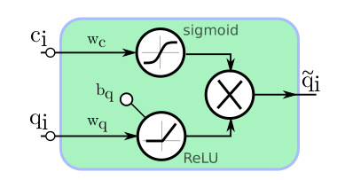
        
        Here, ci is the confidence score and qi is the x or y coordinates. For 5 coordinates of eyes,ears and nose
        10 CGU are used at input. Each (x,c) and (y,c) pair is fed to these 10 units. These results a feature vector 
        with dimension of (10,1). Then, 3 FC layer is used. These FC layers have 10,10 and 3 units. Final FC layer
        provides gaze direction g=[g_x , g_y] and a confidence score for gaze estimation.
        
        During network training, cosine uncertanity loss function is used. The loss function can be observed below:
        
        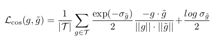
        
        Here, g is the ground truth, g_tilda is predicted result and sigma_g_tilda is network uncertanity.
        As angular error between ground truth and prediction increases, loss increases and during optimization
        uncertanity increases to decrease loss value. In this way, a higher network results with higher uncertanity
        when angular error is large.
        
   * Paper Results
        Results over GazeFollow dataset can be seen below:
        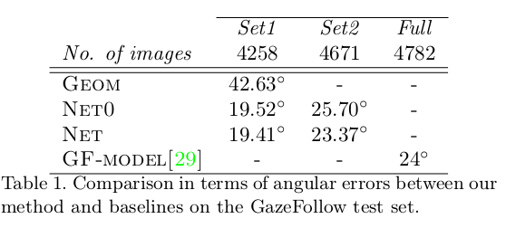
        
        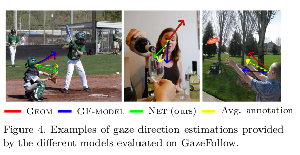
        
        Here, Geom model is a gemotric based method which applies hand-crafted techniques. GF-Model is 
        the architecture described with paper of GazeFollow dataset. NET is the architecture defined here and
        NET0 is a different version of NET which does not use prediction uncertanity provided by OpenPose. Results
        over GazeFollow set2 shows that using uncertanity values increases accuracy by amount of 2.33 degree.
        
### 2. RT-GENE: Real-Time Eye Gaze Estimation in Natural Environments (ECCV-2018)
    
   - Paper Repository: https://github.com/Tobias-Fischer/rt_gene
   - Paper Link: http://openaccess.thecvf.com/content_ECCV_2018/papers/Tobias_Fischer_RT-GENE_Real-Time_Eye_ECCV_2018_paper.pd
   
   - Contributions
   
       Authors contributions are s.t.:
       
       * A method for gaze dataset generation with eye-tracking glasses
       * A neural network for gaze estimation which reach to state-of-the-art results

   * Proposed Approach
   
       Paper tries to generate a gaze estimation dataset. The proposed method for dataset generation 
       utilized an eye-tracking glasses. During dataset generation, person wear an eye-tracking glasses
       and glasses provides gaze annotations. Then, eye-glasses region is removed from image and removed region is 
       filled by semantic image inpainting. Paper claims that inpaining improves gaze estimation accuracy. 
       The block diagram of proposed method can be seen below:
       
       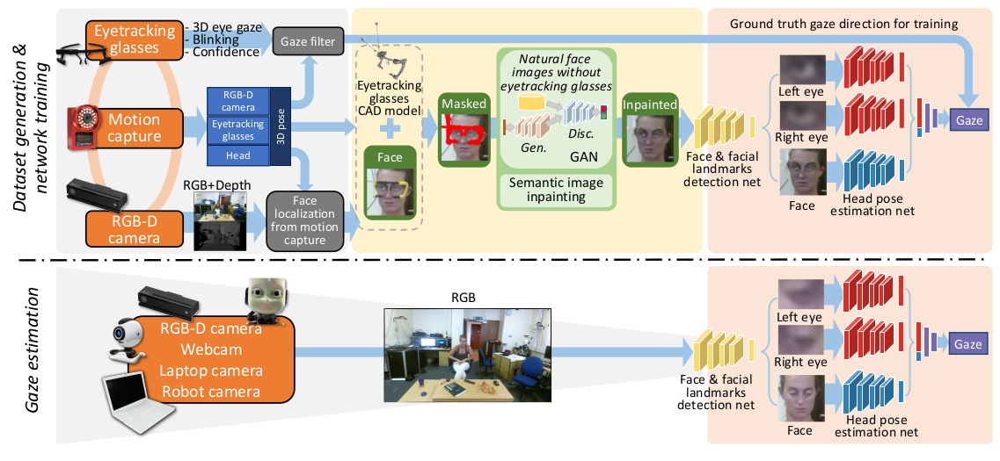
       
       Deep learning based methods have different approcahes for gaze estimation. In these approaches, inputs
       of the network can change. 
       - Eye patches can be directly feed to a CNN for gaze estimation
       - Eye patches and head pose information can be used for gaze estimation
       - Eye patches, face image can be used for gaze estimation
       
       Paper used MTCNN network to detect face along with landmarks point of the eyes,nose and mouth corners. 
       By using extracted landmarks, face patch is rotated and scaled to minimize distance between the aligned 
       landmarks and predefined average face point positions. This provides a normalized face image.(accelerated 
       iterative closest point algorithm is used for normalization). Then, by using eye corners, eye patches are 
       extracted from normalized face image(fixed sized rectangles centered around landmarks). Also, head pose is 
       estimated by adopting the methods used in [Head pose estimation in the wild using convolutional neural 
       networks and adaptive gradient methods].
       
       After extraction of eye patches, each eye image is fed to VGG-16 network for feature extraction. 
       A FC layer of size 512 is used after last max pooling layer of VGG-16 and FC is followed by batch normalization 
       and ReLU layer. FC layers coming from eye patches are combined and it has size of 1024. This final layer is 
       followed another FC with size of 512. This final FC layer size of 512 is combined with head pose information and 
       it is followed two more FC layer with size of 512 and 2 . Final 2 output gives yaw and pitch angle of gaze 
       direction.
       
       Data augmentation is applied. Eye patches are downsampled with ½ and ¼ and then converted to original size by using
       bilinear interpolation. For various lighting conditions, histogram equalization(???) is applied. Color images also
       converted to gray scale images so that gray-scale images also can be used.
       
       As loss function, l2 norm losses between predicted and ground truth gaze vectors are used. The weights of 
       head pose estimation network is fixed and pre-trained model is used. VGG-16 pre-trained on ImageNet is used. 
       FC layer weights are initialized by Xavier initialization. Adam optimizer is used with learning rate of 0.001,
       b1=0.9,b2=0.95 and batch size of 256.
       
   * Paper Results
   
       Paper reaches 4.3 +- 0.9 degree erro ove MPII Gaze Dataset and 5.1 +- 0.2 degree error over UT Multiview dataset.
       
### 3. Recurrent CNN for 3D Gaze Estimation using Appearance and Shape Cues (BMVA-2018)

   - Paper Repository: https://github.com/crisie/RecurrentGaze
   - Paper Link: http://www.bmva.org/bmvc/2018/contents/papers/0871.pdf
   
   - Contributions
   
       Authors provide an approach for gaze estimation which depends on temporal information. The paper claim is that
       this is the first attempt of using temporal information in gaze estimation problem.

   * Proposed Approach
       Current studies mostly focus on static cases for gaze direction estimation. This paper focused on floating cases
       and claim that using image sequence(containing images from different time instances) can improve estimation 
       accuracy for floating case. For this reason a Recurrent-CNN network architecture is proposed.
       
       Paper divided related works into two category such that model-based and appearance-based. Model-based methods 
       uses geometric model of the eye and usually requires high resolution images and person specific calibration.
       Appearance-based methods finds direct mapping from eye images to gaze direction. CNN is the state-of-the art 
       mapping strategy for  appearance based methods.
       
       Proposed architecture by paper can be seen in figure given below:
       
       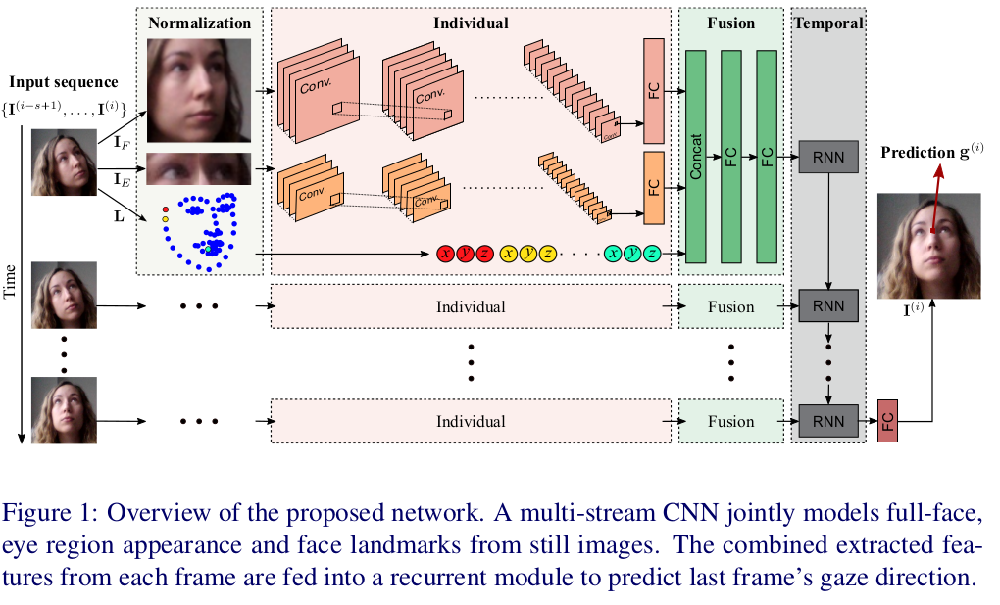
       
       Problem is defined such that a calibrated camera is assumed, head pose information is known and gaze direction 
       is estimated from sequence of image.
       
       Gaze direction is highly affected by head pose and eye images are not sufficient for gaze estimation. Whole face
       images can encode head pose or illumination-specific information across larger areas and useful for gaze 
       estimation. Also 68-landmark model is used to extract landmarks and these are also fed to network.
       
       Paper also applied data normalization to handle with appearance variability and person specific camera 
       configuration problem. Paper said that perspective warping is applied to image and this provides following: 
       all face image is extracted from a virtual camera whose x axis is parallel to head and distance between camera 
       and head in z axis is constant. (I dont know details related to perspective warping???)
       
       Network is divided into 3 modules: Individual, Fusion and Temporal. Individual modules are used for feature 
       extraction. It is applied to whole face image and joint normalized eye patches. Fusion module combines features 
       of head and eye patches with landmarks points. Individual and Fusion modules are also referred as Static model.
       Static model is applied to each frame. Resulting feature vectors from each frame are given as input to Temporal
       module which is many-to-one Recurrent neural network. Gaze direction is estimated at the last frame by using a 
       linear regression module which is added on top of recurrent network.
       
       Individual modules consist of VGG-16 deep network with 13 conv and 5 max pooling layer and 1 FC layer with ReLU.
       After Fusion of face feature, eyes feature and facial landmarks , a single GRU with 128 units is used. VGG are 
       pre-trained on VGG-Face dataset. Network is trained in stage-wise fashion. Firstly Static model and final 
       regression layer is  trained end-to-end on each individual frame. Then, image sequences are constructed with 
       s=4 frames. Individual layers are frozen and features of each frame is extracted. Then, Fusion layer is fined 
       tuned , Temporal layer and regression layer are  trained to estimate gaze direction at the end of 4th frame. 
       ADAM optimizer with 0.0001 learning rate is used. Dropout rate (used in Fusion layer) is set to 0.3 and batch 
       size is 64. 21 epoch training is applied. Average euclidean distance is used for loss function.
       Paper applied data augmentation during training such that: horizontal flip, shifts up to 5 pixels, zoom of 
       up to 2%, brightness changes by a factor in the range of  [0.4,1.75] and additive Gaussian noise with variance 
       of 0.03.
   * Paper Results
   
       Network reaches 3.4 degree angular error over Eye-Diap dataset and following results obtained from studies:
       
       - Paper result showed that data normalization improve accuracy. 
       - Face,eyes and landmark inputs together outperform all other combinations. 
       - Temporal information increases accuracy in floating case scenarios while there is not significant improvement 
       for static case scenarios.
       
### 4. Learning to Find Eye Region Landmarks for Remote Gaze Estimation in Unconstrained Settings(ETRA-2018)
       
   - Paper Repository: https://github.com/swook/GazeML
   - Paper Link: https://ait.ethz.ch/projects/2018/landmarks-gaze/downloads/park2018etra.pdf

   - Contributions
       - Provides an approach which combines conventional methods and the latest appearance based methods
    
   * Proposed Approach
       In previous feature and model based approaches feature extraction was done with hand-crafted techniques. 
       Paper tries to extract accurate eye region landmarks by using CNNs with synthetic eye images. Then, authors 
       try to estimate gaze direction by using these accurate eye region landmarks and conventional feature and 
       model approaches.
       
       * Eye Region Landmarks Localization via Hour Glass Network
           
           Hourglass architecture is firstly designed for human pose estimation. Hourglass architecture tries to 
           capture long-range context by performing repeated improvement of proposed solutions at multiple scales, 
           using so-called “hourglass modules”. Hourglass modules downscaled via pooling operations and then upscaled 
           using bilinear interpolation. At every scale level, a residual is calculated and applied via skip connection 
           from the corresponding layer on the other side of the hourglass. Thus for given feature maps , network refines
           them at 4 different image scales, multiple times. This repeated bottom-up, top-down inference ensures a large
           effective receptive field and allows for the encoding of spatial relation between landmarks, even under
           occlusion.
           
           Network pipeline can be seen in figure given below:
           
           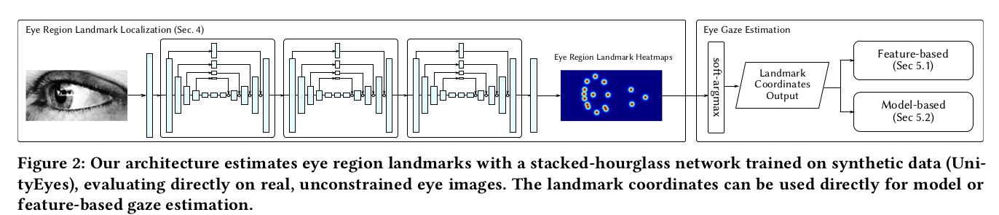
           
           Paper adapt the original architecture to task of landmark detection in eye-images. 64 refined feature maps
           combined via 1x1 convolutional layer to produce 18 heatmaps, each representing the estimated location of 
           a particular eye region landmark. Paper used 3 hourglass modules (with 1 residual module per stage). 
           Single eye image with size of 150x90(from UnityEyes) is used and 18 feature maps size of (75x45) is generated. 
           18 feature maps find 8 limbus region point, 8 iris edge point, 1 iris center and 1 eye-ball center. 18 feature
           maps are given to soft-argmax to find landmark points and then these points are fed to gaze estimation methods.
           
           For each ground truth landmark location ground truth heat map is constructed by placing a 2D gaussian which
           reaches peak at correct location. Then loss function is designed s.t.:
           
           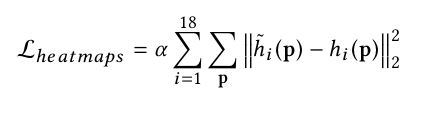
           
            Authors also find eyeball radius by appending 3 FC layer after soft-argmax to regress radius.
           
            Paper apply strong data augmentation to increase accuracy. Translation, rotation, intensity, blur, scale,
            downscale-then upscale and addition lines for artificial occlusions.
           
        * Gaze estimation via Feature based approach
        
            Inner and outer eye corners are found (c1,c2). All detected landmarks coordinates are normalized with eye 
            width (c2-c1) and center the coordinate system on c1. Also, a prior gaze estimation found by subtracting 
            eyeball center from iris center and giving this as an feature improved final accuracy. 17 normalized
            coordinates(8 limbus, 8 iris edge, 1 iris center) and prior estimation are used to find final feature vector
            size of 18. Then, an SVR is trained to find gaze direction(yaw and pitch angles).
            
            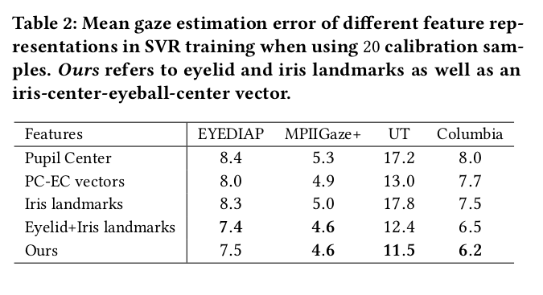
        
            

        * Gaze estimation vie Model based approach 
            
            A simple human eye model is fitted to obtained landmarks. For this purpose, there is no requirements for 
            camera parameters. Landmarks are unprojected in pixel units and then gaze estimation is done.
            
            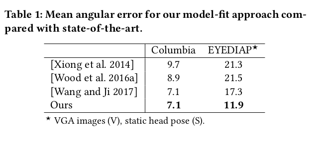
           
### 5. Unsupervised Representation Learning for Gaze Estimation
   - Paper Repository: --------
   - Paper Link: https://arxiv.org/pdf/1911.06939.pdf
    
   - Contributions
        - Unsupervised gaze representation learning:
            An approach to learn low dimensional gaze representations without gaze annotations, relying on a gaze 
            redirection network and loss functions in image domain. This is the first work of unsupervised gaze
            representation learning.
        - Warping field regularization:
            Paper rely on an inverse warping field w to perform gaze redirection. This paper proposed a warping field
            regularization which not only prevents possible overfitting or distortions but also give a physical meaning 
            to the components of the learned unsupervised gaze representations.
            
        - Head pose extensions: 
            Proposed unsupervised method is not limited to gaze estimation but can also be used to process face images 
            and learn a head pose related representation.
            
   * Proposed Approach
        
        The main idea of the proposed method can be seen in figure given below:
                        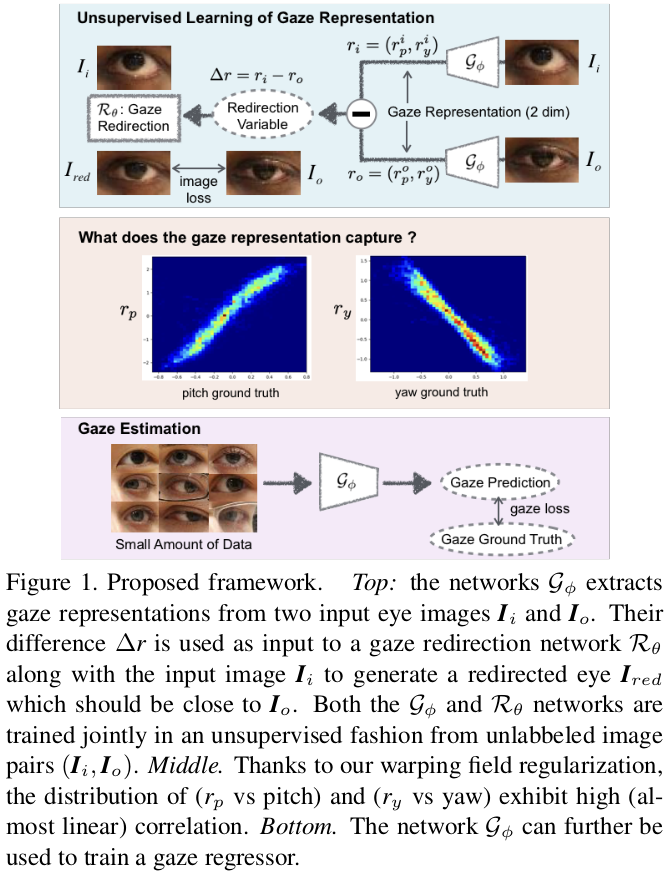
        
        The aim of proposed method  to jointly learn a representation network G and a redirection network R so that
        difference delta_r = r_i - r_o = G(I_i) - G(I_o) between the extracted gaze representations indicated the gaze
        change to be used by the redirection network to generate a redirection image I_red which is as close as possible
        to I_o.
        
        A more detailed framework can be seen below:
        
        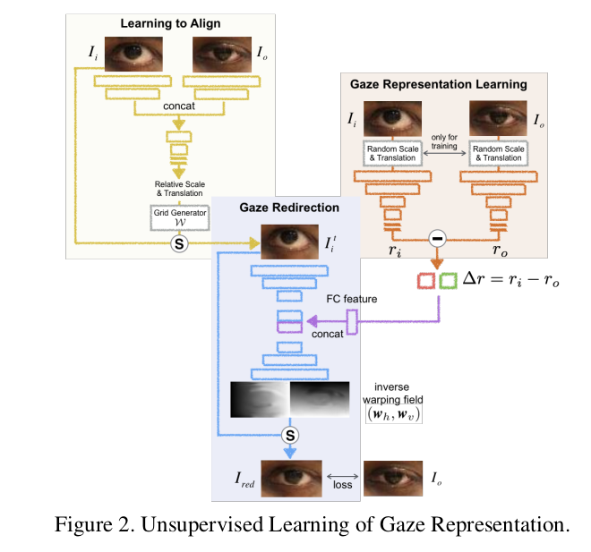
        
        Redirection network does not take input images directly. An alignment network is used to align I_i to I_o.
        After that, redirection network takes aligned image with delta_r information to produce target image.
        
        - Representation Learning
        
            In the figure given in the right, detail of representation learning is given. Network output r is two
            dimensional. This is beacuse of that gaze direction can be reprsented by yaw and pitch angle. Also,data
            augmentation is applied s.t random scale and translation. This avoids network to learn any landmark 
            position and enforce it to learn gaze direction.
            
        - Alignment Network
            
            Alignment network takes I_i and I_o as input and predicts the motion parameters(translation and relative
            scale) between I_i and I_o. In the first few layers, the two images are processed by separate network 
            branches with shared weights. Then the extracted image features are concatenated and further processed 
            to predict the geometric parameters. Then, inverse warping field transforming applied to I_i to align it 
            with I_o.(?????? Inverse warping, grid sampling)
            
        - Redirection Network
        
            The main part is an encoder-decoder network f_R trained to predict a warping field w which warps the aligned
            input using a grid sampling operation(????) and synthesize a gaze redirection output I_red. 
            In its bottleneck part, the network also receives feature maps generated from the retargeting gaze information
            delta_r. The encoder ought to encode the eye structure(apperance) related information of aligned input image,
            while representation learning network should only learn to encode gaze change.
           
        - Few-Shot Gaze Estimation
            After network is trained and representation learning network starts to provide information related to gaze 
            direction, two steps applied to adapt for gaze direction estimation.
            The first one is linear adaption. From a few annotated samples k_p,b_p and k_y, b_y are calculated for linear
            adaption. Formulation for final gaze estimation is below:
            
            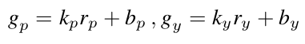
            
            The second one is fine tuning using very few(~100) annotated samples for final accurate prediction.
            
       
   * To be added
     Loss function details, warping field regularization, gaze representation dropout.... (This are advanced details..)
        
### 6. Few-Shot Adaptive Gaze Estimation
   - Paper Repository: https://github.com/NVlabs/few_shot_gaze
   - Paper Link: https://arxiv.org/pdf/1905.01941.pdf
    
   - Contributions
   
     * A novel framework for learning person-specific gaze networks with few calibration samples, fusing the benefits of
       rotation-equivariant feature learning and meta-learning
       
     * A novel encoder-decoder architecture that disentangles gaze direction, head pose and appearance factors
     
     * A novel and effective application of meta-learning to the task of few-shot personalization
   
   * Proposed Approach
   
     - FAZE Framework:
     
         A person spesific gaze estimator must encode factors particular to the person. the first step in F AZE is to learn
         a generalizable latent embedding space that encodes information pertaining to the gaze-direction, including 
         person-specific aspects.
         
     - Gaze-Equivariant Feature Learning
     
        Authors extend the transforming encoder-decoder architecture to consider three distinct factors apparent in the 
        setting: gaze direction, head orientation, and other factors related to the appearance of the eye region in given
        images. Authors disentangle the three factors by explicitly applying separate and known differences in rotations
        (eye gaze and head orientation) to the respective sub-codes. They refer to this architecture as the Disentangling
        Transforming Encoder-Decoder (DT-ED).
        
        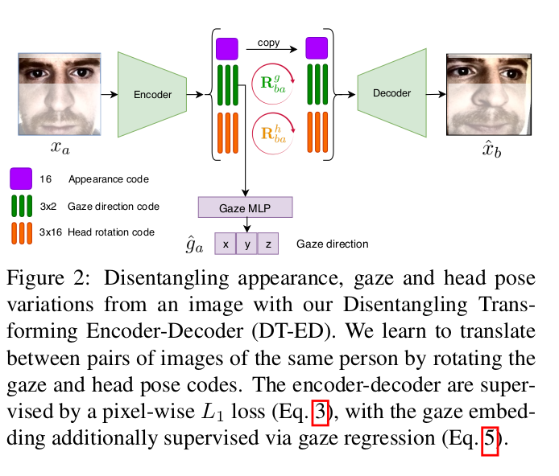
        
        Two images are fed to network given above. After encoder step, latent code divided three. Rotation angle of head
        and eye between two image is known since ground truth is available. Rotation is applied to part corresponds to
        head pose angle and gaze direction angle and then second image is tried to be constructed by using this transformed
        latent code. In this way, latent code is disentagled to three part, apperance, gaze, head.
        
        The loss function is construted with three part. The first one is direct l1 norm loss. l1 norm difference between
        target image and reconstructed image is used. The second loss term is embedding consistency loss. The images of same
        person should result with similar latent code besides of gaze direction part. For this reason after encoding part,
        gaze direction code is translated to frontal side and final code is used to construct an embedding consistency loss.
        The images from the same person used during this loss term. The final loss term is gaze direction loss. An MLP added
        after gaze code part, and difference between ground truth and MLP output is also added to total loss function.
        
     - Person-specific Gaze Estimation
     
       Few-shot meta learning approach is applied for person spesific gaze estimation. Dataset is divided into two part s.t
       training and test set. There is not overlapping person in training and test set. Then, during each iteration of meta
       learning a person is chosen randomly and its images are divided into two set s.t. calibration and validation set.
       In first step calibration set, in second step valdiation set is used. 
       Formulation of weight update at n'th step of meta learning is given below:
       
       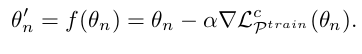
       
       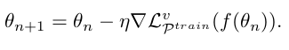
       
       These iterations continue until convergence to optimal weights.
       
       During test, a few sample of person is used as calibration set. Weights are updated by using calibration set and
       then updated weights are used for testing purpose. Clibration update formula during test can be seen below:
       
       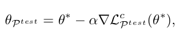
       
   * Paper Results
   
     Paper results clearly shows that using meta - few shot learning strategy avoids overfitting and fine-tuning over 
     meta learning increases accuracy. 
     
     Paper results shows that using disentangling of latent code approach decreases error from 5.67 to 4.8 compared to
     an vanilla encoder with meta learning approach.
     
     Paper shows that adding gaze loss and embeding consistency loss terms to l1 norm loss decreases error by amount of 
     %36.
     
     ....
     
     
     
### b) Datasets

### c) Competitions 
#### i.   MPII Gaze Dataset
   - RT-GENE: Real-Time Eye Gaze Estimation in Natural Environments (ECCV-2018)
   
        4.3+-0.9 degree error
        
   - It’s Written All Over Your Face: Full-Face Appearance-Based Gaze Estimation(2017)
   
        4.8+-0.7 degree error

#### ii.  UT Multiview Dataset
   - RT-GENE: Real-Time Eye Gaze Estimation in Natural Environments (ECCV-2018)
   
        5.1+-0.2 degree error
        
   - Appearance-Based Gaze Estimation in the Wild(2015)
   
        5.9 degree error
        
#### iii. Eye-Diap Dataset
   - Recurrent CNN for 3D Gaze Estimation using Appearance and Shape Cues (BMVA-2018)
   
        3.4 degree error

### PAPER LIST
#### 1. Gaze Estimation for Assisted Living Environments(WACV-2020)
#### 2. RT-GENE: Real-Time Eye Gaze Estimation in Natural Environments (ECCV-2018)
#### 3. Recurrent CNN for 3D Gaze Estimation using Appearance and Shape Cues (BMVA-2018)
#### 4. Learning to Find Eye Region Landmarks for Remote Gaze Estimation in Unconstrained Settings(ETRA-2018)

#### 5. Unsupervised Representation Learning for Gaze Estimation
#### 6. Few-Shot Adaptive Gaze Estimation
#### Deep Pictorial Gaze Estimation

#### Learning from Simulated and Unsupervised Images through Adversarial Training(2017)
#### Learning an appearance-based gaze estimator from one million synthesised images(2016)

link to the latest papers 
https://paperswithcode.com/task/gaze-estimation/codeless
